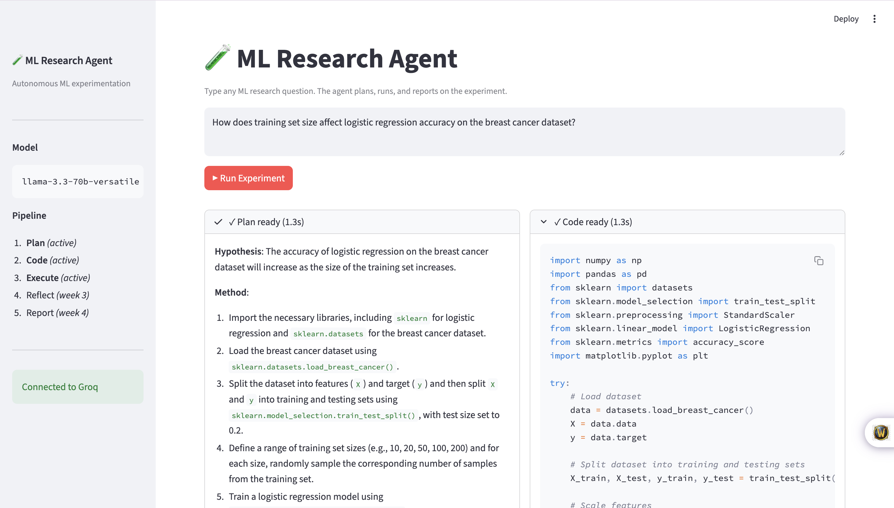

# 🧪 ML Research Agent

> An AI agent that **plans, runs, and reports on ML experiments** — autonomously.

You type a research question. The agent makes a plan, runs the actual code in a sandbox, reflects on errors, and writes a report — all in a single web UI.

## Screenshots

<p align="center">
  <br/>
  <br/>
  <br/>
  <br/>
  <br/>
  <br/>
  <br/>
  
</p>

## Demo

Type a question like *"Does LoRA rank affect GSM8K accuracy on Pythia-160M?"* and watch the agent:
1. **Plan** the experiment (which models, datasets, hyperparameters)
2. **Execute** it in a sandboxed Python environment
3. **Reflect** on errors and re-plan
4. **Report** the result with plots and a written summary

## Quick start

```bash
# 1. Install (creates a .venv and installs deps)
make install

# 2. Get a free Groq API key at https://console.groq.com/keys
cp .env.example .env
# edit .env and paste your key

# 3. Launch the demo
make run
# → http://localhost:8501
```

The app works in **demo mode without a key** — the planner streams a hard-coded plan so you can see the UI immediately. With a Groq key, it uses Llama 3.3 70B for real planning.

## Roadmap

| Week | Feature |
|---|---|
| 1 ✅ | Streamlit 4-panel UI · streaming Groq planner |
| 2 | LangGraph state machine · e2b sandbox executor |
| 3 | Critic + reflection loop |
| 4 | Final report writer · arXiv RAG (citations) |
| 5 | Knowledge graph · benchmark dashboard · cloud deploy |

## Stack

- **LLM**: Groq (Llama 3.3 70B, free)
- **UI**: Streamlit with live token streaming
- **Sandbox** (week 2): e2b free tier
- **Orchestration** (week 2): LangGraph
- **Tracking** (week 3): MLflow + LangSmith
- **All free**, runs on a Mac with no GPU

## Project layout

```
ml-research-agent/
├── src/mlra/
│   ├── config.py            # pydantic-settings (.env loader)
│   └── agent/
│       └── planner.py       # streaming Groq planner (demo-mode fallback)
├── app/
│   └── streamlit_app.py     # 4-panel demo UI
├── tests/unit/              # smoke tests, no API needed
└── .github/workflows/ci.yml # ruff + pytest on every push
```

## Quality

```bash
make test    # pytest
make lint    # ruff
make format  # ruff format
```
